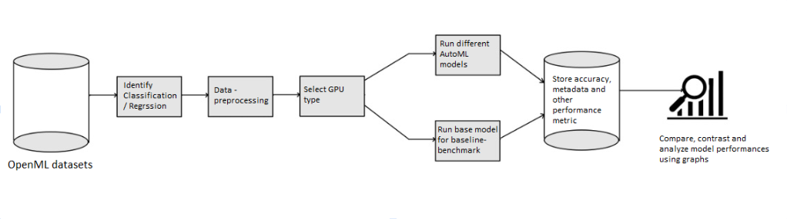
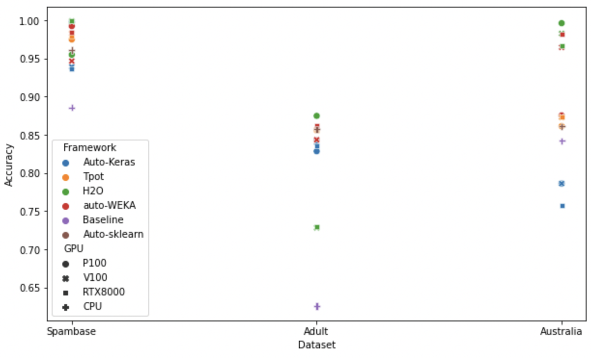
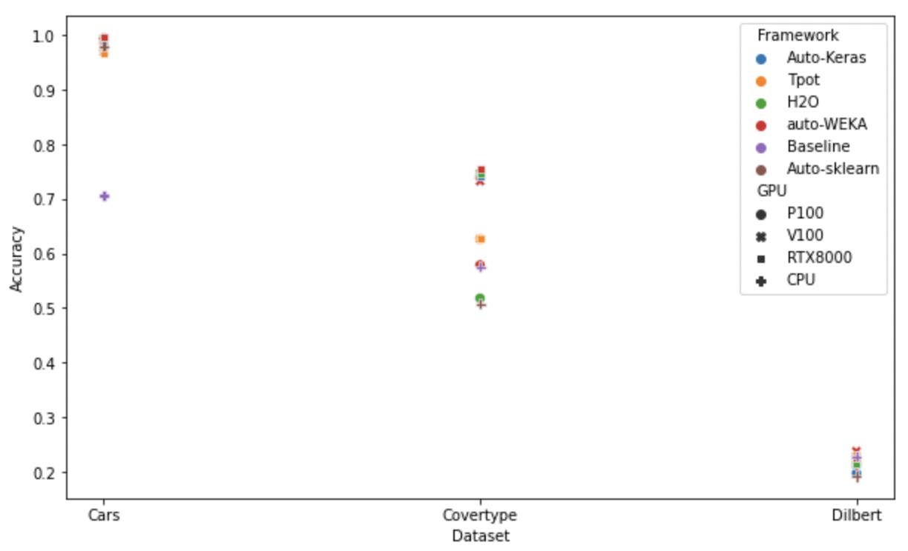
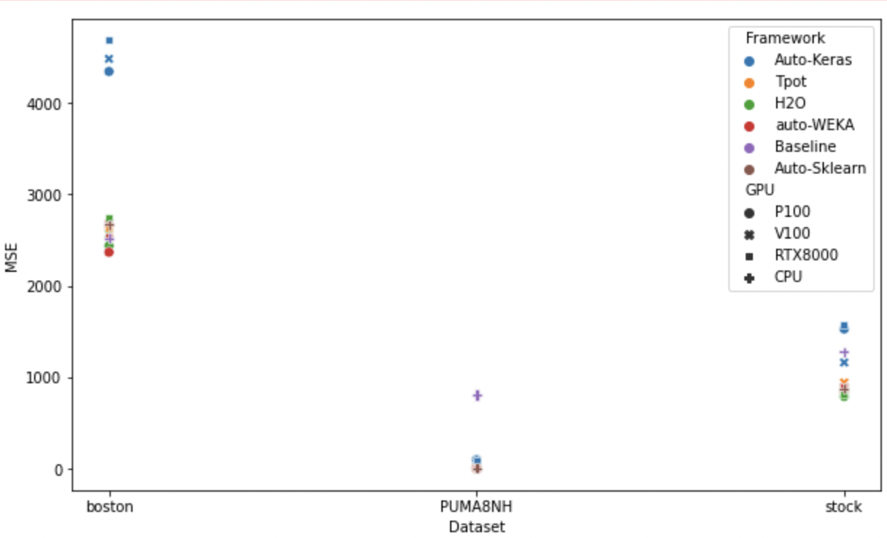
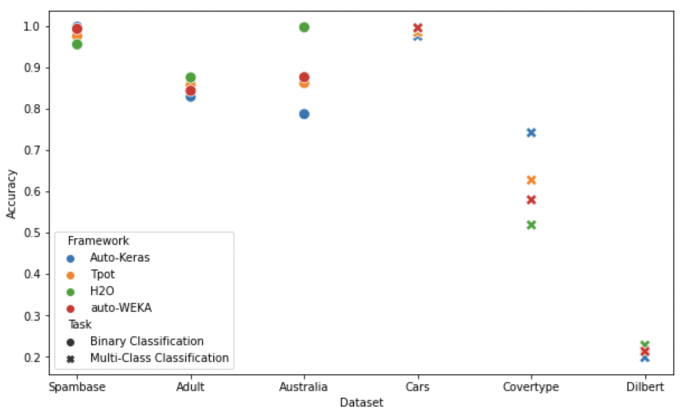
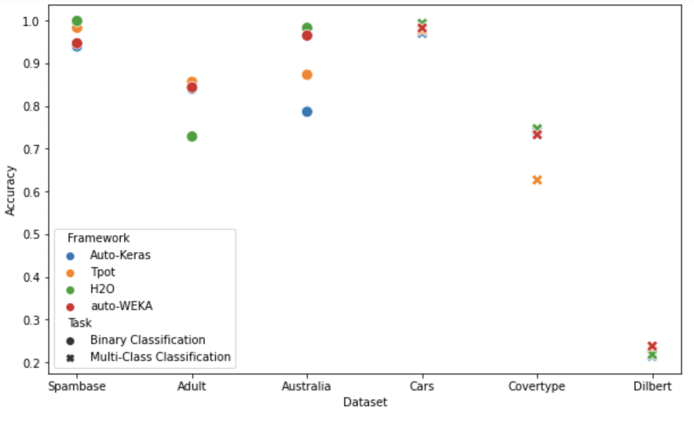
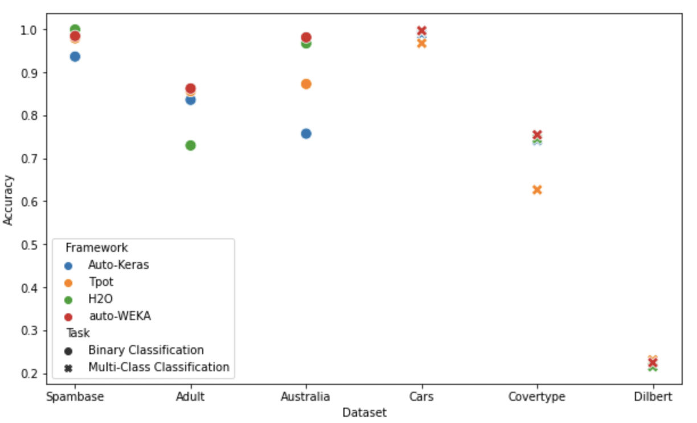
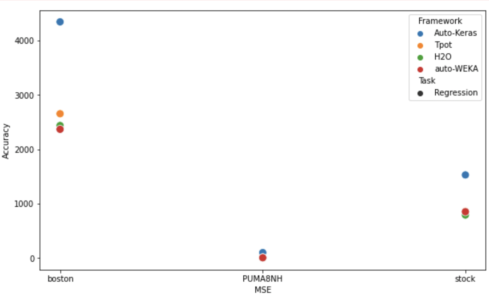
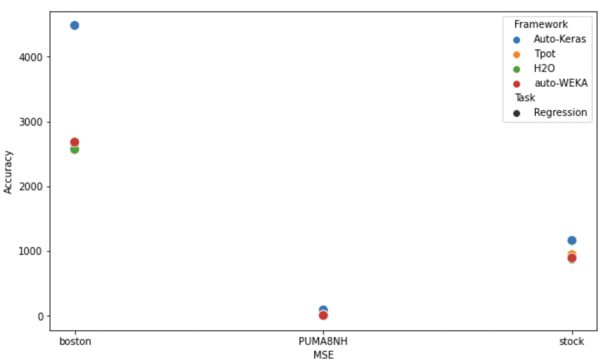
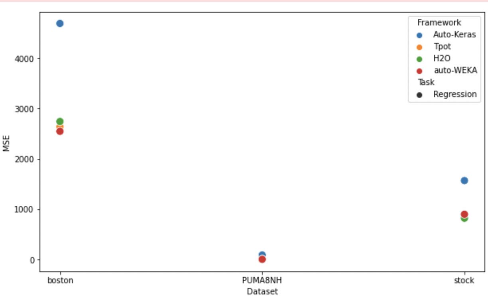

### Auto ML Comparison :
Choosing and Optimizing Machine Learning model is a laborious and time intensive task which requires broad mastery.
The field of AutoML is centered around automizing this task. It accelerate this process allowing professionals to free up time for other valuable tasks.
It is emerging and gaining widespread acceptance.
No universally best AutoML approach.
Our solution focuses mainly on helping the practitioners select the right autoML tools for the right tasks by comparing and contrasting their performance on different datasets, and architectures
We compare and constrast the performance of different AutoML frameworks on different tasks such as Binary Classification, Multi-Class classification, Regression.
We aim to juxtapose the performance of AutoML libraries on different GPUs.

### Repository Structure :
```
AutoML-Comparison
|   README.md
|
+---Dataset
|       csv_result-dataset_44_spambase.csv
|
\---IPYNB
    +---Binary
    |   +---Autokeras
    |   |   +---collab
    |   |   |       Autokeras_adult_collab.ipynb
    |   |   |       Autokeras_australian_collab.ipynb
    |   |   |       Autokeras_spam_collab.ipynb
    |   |   |
    |   |   +---rtx8000
    |   |   |       Autokeras_adult_rtx8000.ipynb
    |   |   |       Autokeras_australian_rtx8000.ipynb
    |   |   |       Autokeras_spam_rtx8000.ipynb
    |   |   |
    |   |   \---v100
    |   |           Autokeras_adult_v100.ipynb
    |   |           Autokeras_australian_v100.ipynb
    |   |           Autokeras_spam_v100.ipynb
    |   |
    |   +---Autosklearn
    |   |   \---rtx8000
    |   |           AutoSklean_adult_rtx8000.ipynb
    |   |           AutoSklean_australian_rtx8000.ipynb
    |   |           AutoSklean_Spam_rtx8000.ipynb
    |   |
    |   \---tpot
    |       +---collab
    |       |       tpot_adult_collab.ipynb
    |       |       tpot_australian_collab.ipynb
    |       |       tpot_spam_collab.ipynb
    |       |
    |       +---rtx8000
    |       |       tpot_adult_rtx8000.ipynb
    |       |       tpot_australian_rtx8000.ipynb
    |       |       tpot_spam_rtx8000.ipynb
    |       |
    |       \---v100
    |               tpot_adult_v100.ipynb
    |               tpot_australian_v100.ipynb
    |               tpot_spam_v100.ipynb
    |
    +---Multi-Class
    |   +---Autokeras
    |   |   +---collab
    |   |   |       Autokeras_car_collab.ipynb
    |   |   |       Autokeras_covertype_collab.ipynb
    |   |   |       Autokeras_dilbert_collab.ipynb
    |   |   |
    |   |   +---rtx8000
    |   |   |       Autokeras_car_rtx8000.ipynb
    |   |   |       Autokeras_covertype_rtx8000.ipynb
    |   |   |       Autokeras_dilbert_rtx8000.ipynb
    |   |   |
    |   |   \---v100
    |   |           Autokeras_car_v100.ipynb
    |   |           Autokeras_covertype_v100.ipynb
    |   |           Autokeras_dilbert_v100.ipynb
    |   |
    |   +---Autosklearn
    |   |       AutoSklean_car_collab.ipynb
    |   |       AutoSklean_covertype_collab.ipynb
    |   |       AutoSklean_dilbert_collab.ipynb
    |   |
    |   \---tpot
    |       +---collab
    |       |       tpot_car_colab.ipynb
    |       |       tpot_covertype_colab.ipynb
    |       |       tpot_dilbert_colab.ipynb
    |       |
    |       +---rtx8000
    |       |       tpot_car_rtx8000.ipynb
    |       |       tpot_covertype_rtx8000.ipynb
    |       |       tpot_dilbert_rtx8000.ipynb
    |       |
    |       \---v100
    |               tpot_car_v100.ipynb
    |               tpot_covertype_v100.ipynb
    |               tpot_dilbert_v100.ipynb
    |
    \---Regression
        +---Autokeras
        |   +---collab
        |   |       Autokeras_boston_collab.ipynb
        |   |       Autokeras_puma8nh_collab.ipynb
        |   |       Autokeras_stock_collab.ipynb
        |   |
        |   +---rtx8000
        |   |       Autokeras_boston_rtx8000-mse.ipynb
        |   |       Autokeras_puma8nh_rtx8000.ipynb
        |   |       Autokeras_stock_rtx8000.ipynb
        |   |
        |   \---v100
        |           Autokeras_boston_v100-mse.ipynb
        |           Autokeras_puma8nh_v100.ipynb
        |           Autokeras_stock_v100.ipynb
        |
        +---Autosklearn
        |       AutoSklean_boston_collab.ipynb
        |       AutoSklean_puma8nh_collab.ipynb
        |       AutoSklean_STOCK_collab.ipynb
        |
        \---tpot
            +---collab
            |       tpot_boston_colab
            |       tpot_PUMA8NH_collab.ipynb
            |       tpot_stock_colab.ipynb
            |
            +---rtx8000
            |       tpot_boston_rtx8000.ipynb
            |       tpot_PUMA8NH_rtx8000.ipynb
            |       tpot_stock_rtx8000.ipynb
            |
            \---v100
                    tpot_boston_v100.ipynb
                    tpot_PUMA8NH_v100.ipynb
                    tpot_stock_v100.ipynb

```
### AutoML Libraries :
The AutoML libraries that we use 
- AutoKeras
- Auto-sklearn
- Tpot
- H2O
- AutoWEKA  

To install the above libraries
### Installation :
- Autokeras :  `pip install autokeras`  
- Auto-sklearn : `pip install auto-sklearn`  
- Tpot : `pip install Tpot`  
- H2O : `pip install h2o`  

Once you have these libraries installed, running our scripts is just the same as running a jupyter notebook/ colab.

### Tasks Comparison :
- Binary Classification
- Multiclass Classification
- Regression

### GPUs Used for Comparison :
- Tesla P100
- Tesla V100
- Nvdia RTX8000

### Architecture : 

### Results :  
### Binary and Multi-class Classification :


- The CPU Base model(with no optimization) performs the worst in both Binary and Multiclass Classification as expected
- As we can see that in Multi-Class Classification, the Dilbert dataset’s accuracy is very low. We infer that 60 mins was not sufficient for the frameworks to search for the best model given that the number of features in Dilbert is very high(2000).
- In Binary Classification H20 outperforms other AutoML libraries, whereas AutoKeras doesn’t yield the bet performance in Multi-Class Classification which can be attributed to the limited number of epochs to run
- Amongst all GPUs the frameworks achieve the best accuracy on P100 for Binary whereas in multiclass it performs the best in RTX8000 under the 60 min constraint.

### Regrssion :

- Again, similar to Binary and Multi-class Classification , In regression the CPU baseline model performs the worst
- H20 and AutoWEKA outperform other AUTOML libraries
- In terms of GPU performance, in P100, every library show the least MSE under 60 min constraint

### Performance On P100, V100 & RTX8000 GPUs for Binary and Multi-class Classification



- The above three images show the performance of different autoML libraries, on different types of datasets on P100, V100 and RTX8000 GPUs for Binary and MultiClass classifications
- As we can there is no considerable difference between the best performance of different autoML libraries under P100, V100 and RTX8000 GPUs. 
- Given faster GPUs all algorithm seem to find the best model, here in this case it is P100,
    - For example Autokeras almost matches the performance of H20 in P100, whereas in V100 it is far off. Similarly between V100 and RTX8000, Autokeras seems to perform better on V100 than RTX8000.
- In P100, for binary classification tasks H2O framework seems to perform better than other frameworks whereas for multi-class classification tasks, Autokeras seems to perform better than other frameworks. 
- In V100, H2O framework seems to perform better than other frameworks for both binary and multi-class classification tasks.
- In RTX8000, autoWEKA framework outperforms other frameworks in both binary and multi-class classification tasks.

### Performance On P100, V100 & RTX8000 GPUs for Regression



- The above three images show the performance of different autoML libraries, on different types of datasets on P100, V100 and RTX8000 GPUs for regression tasks
- As we can there is no considerable difference between the best performance of different autoML libraries under P100, V100 and RTX8000 GPUs. 
- Given faster GPUs all algorithm seem to find the best model, here in this case it is P100,
    - For example Autokeras almost matches the performance of H20 in P100, whereas in V100 it is far off. Similarly between V100 and RTX8000, Autokeras seems to perform better on V100 than RTX8000.
- In all three GPUs, autokeras framework seems to perform the worst, compared to other frameworks for regression tasks.
- In all three GPUs, autoWEKA framework outperforms other frameworks in regression tasks.


